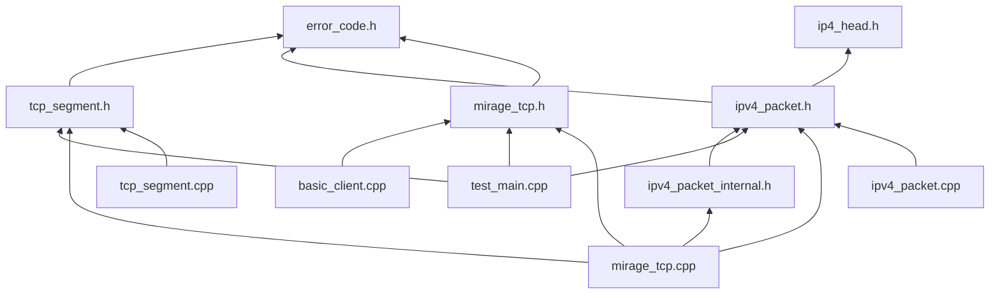

# MirageTCP Dependency Graph

本文档描述当前项目里与 `MirageTcp` 主路径直接相关的头文件/实现文件引用关系。

约定：

- 图的上方是更基础、被依赖的文件
- 图的下方是更具体、依赖别人的文件
- 箭头方向表示“当前文件引用了目标文件”

## 分层说明

- 基础定义：
  [`error_code.h`](C:/dev/MirageTCP/include/mirage_tcp/error_code.h)
  [`ip4_head.h`](C:/dev/MirageTCP/include/mirage_tcp/ip4_head.h)

- 公共接口与协议视图：
  [`mirage_tcp.h`](C:/dev/MirageTCP/include/mirage_tcp/mirage_tcp.h)
  [`ipv4_packet.h`](C:/dev/MirageTCP/include/mirage_tcp/ipv4_packet.h)
  [`tcp_segment.h`](C:/dev/MirageTCP/include/mirage_tcp/tcp_segment.h)

- 库内私有声明：
  [`ipv4_packet_internal.h`](C:/dev/MirageTCP/src/ipv4_packet_internal.h)

- 实现与使用者：
  [`mirage_tcp.cpp`](C:/dev/MirageTCP/src/mirage_tcp.cpp)
  [`ipv4_packet.cpp`](C:/dev/MirageTCP/src/ipv4_packet.cpp)
  [`tcp_segment.cpp`](C:/dev/MirageTCP/src/tcp_segment.cpp)
  [`test_main.cpp`](C:/dev/MirageTCP/tests/test_main.cpp)
  [`basic_client.cpp`](C:/dev/MirageTCP/examples/basic_client.cpp)

## 当前边界

- `Ip4Head` 是协议头定义，单独放在 `ip4_head.h`
- `Ip4PacketView` 是 `MirageTCP` 的 IPv4 包视图，定义在 `ipv4_packet.h`
- `parse_ipv4_packet()` 不是公共 API，只通过 `ipv4_packet_internal.h` 暴露给库内部实现
- `MirageTcp` 的外部调用方只需要依赖 `mirage_tcp.h`
