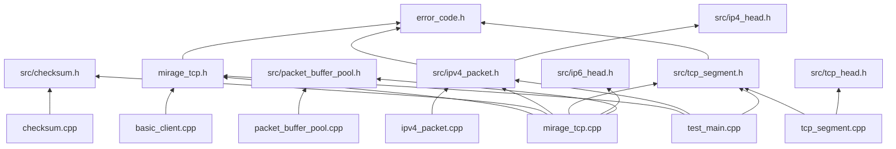

# MirageTCP Dependency Graph

本文档描述当前项目里与 `MirageTcp` 主路径直接相关的头文件/实现文件引用关系。

约定：

- 图的上方是更基础、被依赖的文件
- 图的下方是更具体、依赖别人的文件
- 箭头方向表示“当前文件引用了目标文件”

```mermaid
graph BT
    Q["checksum.cpp"] --> P["src/checksum.h"]
    H["ipv4_packet.cpp"] --> B["src/ipv4_packet.h"]
    O["packet_buffer_pool.cpp"] --> R["src/packet_buffer_pool.h"]
    I["tcp_segment.cpp"] --> C["src/tcp_segment.h"]
    I --> L["src/tcp_head.h"]
    F["mirage_tcp.cpp"] --> A["mirage_tcp.h"]
    F --> P
    F --> B
    F --> C
    F --> M["src/ip6_head.h"]
    F --> R

    J["test_main.cpp"] --> A
    J --> B
    J --> C

    K["basic_client.cpp"] --> A
    A --> D["error_code.h"]
    B --> D
    B --> E["src/ip4_head.h"]
    C --> D
```

## 分层说明

- 基础定义：
  [`error_code.h`](C:/dev/MirageTCP/include/mirage_tcp/error_code.h)
  [`checksum.h`](C:/dev/MirageTCP/src/checksum.h)
  [`ip4_head.h`](C:/dev/MirageTCP/src/ip4_head.h)
  [`ip6_head.h`](C:/dev/MirageTCP/src/ip6_head.h)
  [`tcp_head.h`](C:/dev/MirageTCP/src/tcp_head.h)

- 公共接口：
  [`mirage_tcp.h`](C:/dev/MirageTCP/include/mirage_tcp/mirage_tcp.h)

- 库内私有声明：
  [`ipv4_packet.h`](C:/dev/MirageTCP/src/ipv4_packet.h)
  [`tcp_segment.h`](C:/dev/MirageTCP/src/tcp_segment.h)
  [`packet_buffer_pool.h`](C:/dev/MirageTCP/src/packet_buffer_pool.h)

- 实现与使用者：
  [`checksum.cpp`](C:/dev/MirageTCP/src/checksum.cpp)
  [`mirage_tcp.cpp`](C:/dev/MirageTCP/src/mirage_tcp.cpp)
  [`ipv4_packet.cpp`](C:/dev/MirageTCP/src/ipv4_packet.cpp)
  [`packet_buffer_pool.cpp`](C:/dev/MirageTCP/src/packet_buffer_pool.cpp)
  [`tcp_segment.cpp`](C:/dev/MirageTCP/src/tcp_segment.cpp)
  [`test_main.cpp`](C:/dev/MirageTCP/tests/test_main.cpp)
  [`basic_client.cpp`](C:/dev/MirageTCP/examples/basic_client.cpp)

## 当前边界

- `include/mirage_tcp/` 现在只保留两个 public 头：`mirage_tcp.h` 与 `error_code.h`
- `Ip4Head`、`Ip6Head`、`TcpHead`、`Ip4PacketView`、`TcpSegment` 都属于内部协议细节，放在 `src/`
- `PacketBufferPool`、`Checksum` 也都是内部实现细节，放在 `src/`
- `parse_ipv4_tcp_packet()` 虽然声明在 `src/ipv4_packet.h`，但仍然只是库内部接口，不属于 public API
- `MirageTcp` 的外部调用方只需要依赖 `mirage_tcp.h`
