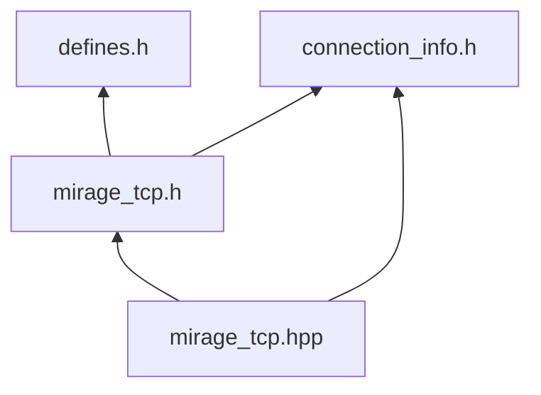
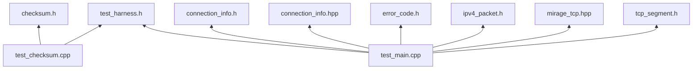
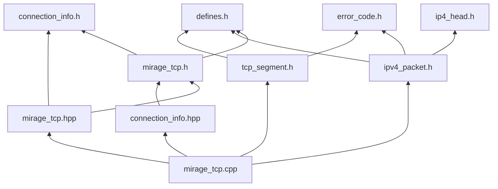

# Header And Source Include Graph

- 每张图只覆盖一个关注点
- 仍然使用 `graph BT`
- 被引用文件在上面，引用者在下面，箭头向上

## 1. Public Header 分层

只看 `include/mirage_tcp/` 下公开头之间的依赖关系。

## 2. Core Source 依赖

只看 `src/*.cpp` 到 `src/*.h` / public 头的依赖，排除测试。
图中节点只显示文件名，不重复写 `src/` 前缀。

```mermaid
graph BT
    checksum["checksum.h"]
    connection_info_hpp["connection_info.hpp"]
    ip6_head["ip6_head.h"]
    ipv4_packet["ipv4_packet.h"]
    mirage_tcp["mirage_tcp.h"]
    mirage_tcp_hpp["mirage_tcp.hpp"]
    tcp_head["tcp_head.h"]
    tcp_segment["tcp_segment.h"]
    packet_buffer_pool_h["packet_buffer_pool.h"]

    checksum_cpp["checksum.cpp"]
    connection_info_cpp["connection_info.cpp"]
    ipv4_packet_cpp["ipv4_packet.cpp"]
    mirage_tcp_cpp["mirage_tcp.cpp"]
    packet_buffer_pool_cpp["packet_buffer_pool.cpp"]
    tcp_segment_cpp["tcp_segment.cpp"]

    checksum_cpp --> checksum
    connection_info_cpp --> connection_info_hpp
    ipv4_packet_cpp --> ipv4_packet
    packet_buffer_pool_cpp --> packet_buffer_pool_h
    tcp_segment_cpp --> tcp_segment
    tcp_segment_cpp --> tcp_head

    mirage_tcp_cpp --> checksum
    mirage_tcp_cpp --> connection_info_hpp
    mirage_tcp_cpp --> ip6_head
    mirage_tcp_cpp --> mirage_tcp_hpp
    mirage_tcp_cpp --> ipv4_packet
    mirage_tcp_cpp --> tcp_head
    mirage_tcp_cpp --> tcp_segment
    mirage_tcp_cpp --> packet_buffer_pool_h
```

## 3. Test 依赖

只看测试入口依赖哪些 public 头、内部头和测试辅助头。

## 4. 最小主路径

如果只想快速理解主实现链路，看这一张就够了。

